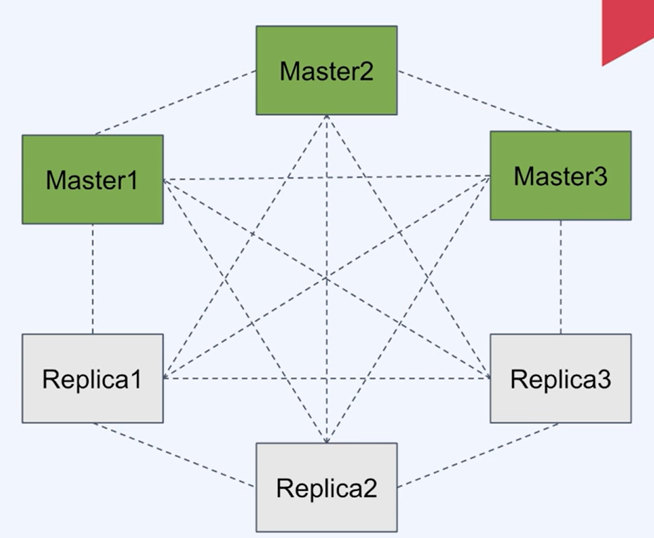

# Redis의 확장성

- [Redis의 확장성](#redis의-확장성)
  - [확장성](#확장성)
    - [분산 시스템에 따른 문제](#분산-시스템에-따른-문제)
    - [수직 확장 (Scale-up)](#수직-확장-scale-up)
    - [분산 시스템의 적용](#분산-시스템의-적용)
  - [Redis Cluster](#redis-cluster)
    - [Redis Cluster의 특정](#redis-cluster의-특정)
    - [Sentinel과 다른점](#sentinel과-다른점)
  - [***데이터 분산***](#데이터-분산)
    - [***데이터를 분산하는 기준***](#데이터를-분산하는-기준)
    - [***Hash Slot을 이용한 분산***](#hash-slot을-이용한-분산)
    - [***클라이언트의 데이터 접근***](#클라이언트의-데이터-접근)
    - [***클러스터를 사용할 때 성능***](#클러스터를-사용할-때-성능)
  - [***클러스터의 데이터 일관성***](#클러스터의-데이터-일관성)
    - [***Auto-Failover***](#auto-failover)
    - [***replica migration***](#replica-migration)

## 확장성

- S/W의 성능이나 용량을 늘리기 위해 시스템의 구조를 변경하는 것
- 주로 규모에 대한 확장성을 의미(데이터 크기, 트래픽 증가)
- 수직 확장(scale-up), 수평 확장(scale-out)으로 나뉨

### 분산 시스템에 따른 문제

- 부분 장애
- 네트워크 실패
- 데이터 동기화
- 로드밸런싱 (or 디스커버리)
- 개발 및 관리의 복잡성
  
### 수직 확장 (Scale-up)

- 처리 요소를 여러개 두어서 분산 처리
- 무중단 확장이 가능
- 이론적으로 무한대로 확장 가능

### 분산 시스템의 적용

- 분산 시스템으로 인한 trade-off를 판단해서 적합하다면 적용
- 서비스의 복잡도와 규모의 증가로 분산은 피할 수 없음

## Redis Cluster

- 여러 노드에 자동적으로 데이터 분산
- 일부 노드의 실패나 통신 단절에도 계속 작동하는 가용성
- 고성능을 보장하면서 선형 확장성을 제공

### Redis Cluster의 특정

- `full-mesh 구조`로 통신
- `cluster bus라는 추가 채널`(port) 사용
- `gossip protocol을 사용`하여 노드간 정보 교환
- `hash slot을 사용`하여 데이터 분산
- `DB0만` 사용 가능
- `multi key 명령어가 제한됨`
- 클라이언트는 모든 노드에 접속
  

### Sentinel과 다른점

- 클러스터는 `데이터 분산(샤딩)을 제공`
- 클러스터는 자동 장애조치를 위해 `모니터링 노드를 추가 배치할 필요가 없음`
- 클러스터는 `multi key 명령어를 지원하지 않음`
- Sentinel은 비교적 단순하고 소규모의 시스템에서 HA가 필요할 때 채택

## ***데이터 분산***

### ***데이터를 분산하는 기준***
- `특정 Key의 데이터가 어느 노드(shard)에 속할것인지 결정`하는 매커니즘
- 보통 분산 시스템에서 해싱이 사용됨
- 단순 해싱으로는 노드의 개수가 변할 떄 모든 맵핑이 새로 계산되어야 하는 문제가 있음
  
  

### ***Hash Slot을 이용한 분산***

- Redis는 16384개의 hash slot으로 Key 공간을 분리하여 관리
- 각 Key는 CRC16 해싱 후 16384로 modulo 연산을 해서 hash slot에 맵핑
- hash slot은 각 노드들에게 나누어 분배

### ***클라이언트의 데이터 접근***

- 클러스터 노드는 요청이 온 `Key에 해당하는 노드로 자동 redirect 해주지 않음`
- 클라이언트는 `MOVED 에러를 받으면 해당 노드로 다시 요청해야함`

### ***클러스터를 사용할 때 성능***

- MOVED 에러에 대한 재용청 문제
  - `클라이언트는 key-node 맵을 캐싱`하므로 `대부분 발생하지 않음`
- 클라이언트 `단일 인스턴스의 redis를 이용할때 와 같은 성능`으로 이용 가능
- 분산 시스템에서 성능은 `데이터 일관성(consistency)와 trade-off` 가 있음
  - Redis Cluster는 `고성능의 확장성을 제공`하면서 `적절한 수준의 데이터 안정성과 가용성을 유지하는 것`을 목표로 함

## ***클러스터의 데이터 일관성***

- Redis Cluster 는 `Strong consistency를 제공하지 않음`
- 높은 성능을 위해 `비동기 복제`를 하기 때문

### ***Auto-Failover***

- 일부 노드(master)가 실패(또는 네트워크 단절) 하더라도 과반수 이상의 master가 남아있고, 사라진 master의 replica들이 있다면 클러스터는 failover되어 가용상태가 됨
- note timeout 동안 과반수의 master와 통신하지 못한 master는 스스로 error state로 전환 후 write 요청을 받지 않음
 

### ***replica migration***

- replica가 다른 master로 migrate 해서 가용성을 높임

