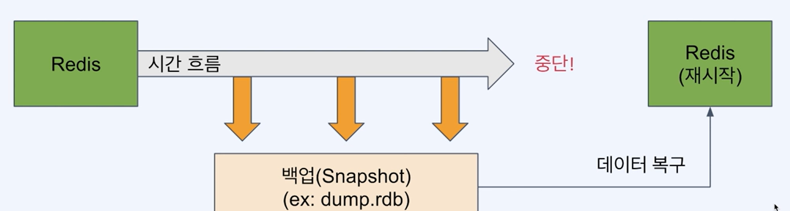
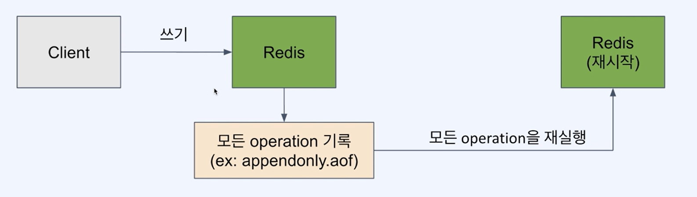
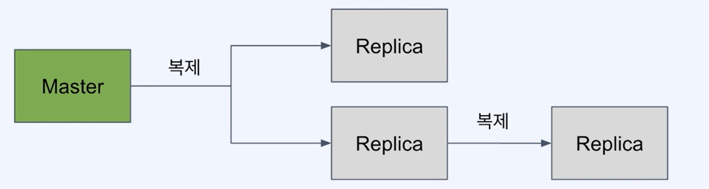
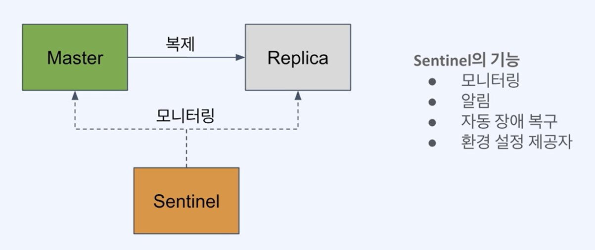
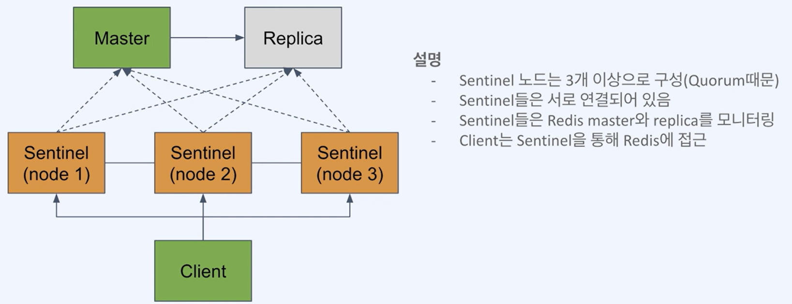

# ***Redis Backup/Failback***

- [***Redis Backup/Failback***](#redis-backupfailback)
  - [***RDB (Redis Database)를 사용한 백업***](#rdb-redis-database를-사용한-백업)
    - [***RDB 사용의 장점***](#rdb-사용의-장점)
    - [***RDB 사용의 단점***](#rdb-사용의-단점)
    - [***RDB 설정***](#rdb-설정)
  - [***Docker를 사용해 Redis 설정 파일 적용***](#docker를-사용해-redis-설정-파일-적용)
  - [***AOF (Append Only File)를 사용한 백업***](#aof-append-only-file를-사용한-백업)
    - [AOF 사용의 장점](#aof-사용의-장점)
    - [***AOF 사용의 단점***](#aof-사용의-단점)
    - [***AOF 설정***](#aof-설정)
      - [***fsync 정책*** (appendsync 설정 값)](#fsync-정책-appendsync-설정-값)
      - [***AOF 관련 개념***](#aof-관련-개념)
  - [***Redis Replication***](#redis-replication)
    - [***Redis 복제 사용***](#redis-복제-사용)
  - [***Redis 자동 장애조치***](#redis-자동-장애조치)
    - [***Redis Sentinel***](#redis-sentinel)
    - [***Redis Sentinel 구성도***](#redis-sentinel-구성도)
    - [***Redis Sentinel 특징***](#redis-sentinel-특징)
      - [***Sentinel 접속 후 확인***](#sentinel-접속-후-확인)
      - [***SpringRedis Sentinel 설정***](#springredis-sentinel-설정)

## ***RDB (Redis Database)를 사용한 백업***

- 특정 시점의 스냅샷으로 데이터 저장
- 재시작 시 RDB 파일이 있으면 읽어서 복구



### ***RDB 사용의 장점***

- **작은 파일 사이즈**로 백업 파일 관리가 용이(원격지 백업, 버전관리)
- **fork를 이용해** 백업하므로 **서비스중인 프로세스에 영향 없음**
- 데이터 스냅샷 방식이므로 **빠른 복구가 가능**

> RDB는 Redis의 기본 설정이며, AOF(Append Only File)는 RDB와 함께 사용 가능

### ***RDB 사용의 단점***

- **스냅샷을 저장하는 시점 사이의 데이터 변경사항은 유실** 될 수 있음
- fork를 이용하기에 **시간이 오래**걸릴 수 있고, CPU/Memory **자원을 많이 사용**
- 데이터 무결성이나 정합성에 대한 요구가 크기 않은경우 사용  
  (마지막 백업 시 에러 발생등의 문제)

### ***RDB 설정***

- 설정 파일 없어도 기본값으로 RDB는 활성화
- 설정 파일을 만드려면 템플릿을 받아서 사용 [(***RDB Template Docs***)](https://redis.io/docs/management/config)

```ini
# 저장 주기 설정 (ex 60초마다 10개이상 변경이 있을때 수행)
save 60 10
# 스냅샷을 저장할 파일명
dbfilename dump.rdb
# 수동으로 스냅샷 저장
bgsave
```

## ***Docker를 사용해 Redis 설정 파일 적용***

- docker run 사용시 -v 옵션으로 설정 파일을 마운트
- redis 이미지 실행 시 redis-server에 직접 redis 설정파일 경로 지정
  
```bash
# Docker 컨테이너 실행 시 설정 파일 적용
docker run -v /{my}/{path}/redis.conf:/redis.conf --name my-redis redis redis-server /redis.conf
```

- 설정 파일 생성 (template docs에서 버전에 맞는 config 다운로드)

```conf
# redis.conf
# Configuration SNAPSHOT 설정 변경
# 60초 동안 10개 이상 변경이 있을 때마다 스냅샷 저장
save 60 10
```

- 스냅샷 저장 테스트

```bash
docker exec -it my-redis /bin/bash
# in container
redis-cli
set a 1
set b 2
...
set 11 11
exit

ls -al /data
# dump.rdb 확인
```

## ***AOF (Append Only File)를 사용한 백업***

- **모든 변경사항을 기록**하는 로그 파일
- 재시작 시 AOF에 기록된 모든 동작을 재수행해서 데이터를 복구



### AOF 사용의 장점

- **모든 변경사항이 기록**되므로 RDB 방식 대비 **안정적으로 백업** 가능
- AOF 파일은 **append-only 방식**으로 백업 파일이 **손상될 위험이 적음**
- **실제 수행된 명령어가 저장**되어 있어 사용자가 보고 **이해할 수 있으며, 수정도 가능**

### ***AOF 사용의 단점***

- RDB 방식에 비해 **AOF 파일 사이즈가 큼**
- RDB 박식 대비 **백업/복구 속도가 느림**  (백업 성능은 fsync 정책에 따라 조절가능)
- **AOF 파일이 손상될 경우** 복구가 어려움

> 참고로 AOF는 RDB와 함께 사용 가능

### ***AOF 설정***

- 설정 파일 없어도 기본값으로 AOF는 비활성화

```ini
# AOF 사용 설정
appendonly yes
# AOF 파일명
appendfilename "appendonly.aof"
# fsync 정책 설정 (always, everysec, no)
appendfsync everysec
```

#### ***fsync 정책*** (appendsync 설정 값)

- fsync() 호출은 OS에게 데이터를 디스크에 쓰도록 하라는 명령
- 가능한 옵션 과 설정

| 옵션 | 설명 |
|:---:|:---|
| **`always`** | 모든 명령어가 수행될 때마다 수행. 가장 안전하지만 가장 느림|
| **`everysec`** | 1초마다 수행. 성능은 RDB와 비슷 |
| **`no`** | OS에 맡김. 가장 빠르지만 덜 안전한 방법.(커널마다 수행시간이 다를수 있음) |

#### ***AOF 관련 개념***

- Log Rewriting : 최종 상태를 만들기 위한 최소한의 로그만 남기기위해 일부를 새로씀  
  (Ex. 1개의 key값을 100번 수정해도 최종 상태는 1개이므로 SET 1개로 대체 가능)
- Multi Part AOF: Redis 7.0 부터 AOF가 단일 파일에 저장되지 않고 여러개로 작성됨
  - `base file` :  rewrite 시의 스냅샷을 저장
  - `incremental file` : 마지막으로 base file이 생성된 이후의 변경사항이 쌓임
  - `manifest file` : 파일들을 관리하기 위한 메타 데이터 저장

## ***Redis Replication***

- 백업만으로는 장애 대비에 부족( 백업실패, 복구 소요시간 등)
- redis도 복제를 통해 가용성 확보 및 빠른 장애조치 가능
- master가 죽었을 경우 replica 중 하나를 master로 전환해 즉시 서비스 정상화
- 복제본(replica)는 **read-only 노드로 사용**가능하여 **traffic 분산 가능**


---

### ***Redis 복제 사용***

- Replica노드에서만 설정을 적용해 master-replica 복제 구성

```ini
# replica node redis.conf
#replicaof <master_ip> <master_port>
replicaof 127.0.0.1 6379

# Replica는 read-only로 사용
replica-read-only yes
```

> ***Master 노드에는 RDB나 AOF 같은 백업 기능 활성화 필수!!!***  
> 재시작 후에 비어있는 데이터 상태가 복제되지 않도록 하기 위함

---

## ***Redis 자동 장애조치***

### ***Redis Sentinel***

- Redis에서 HA(High-Availability)를 제공하는 장치
- master-replica 구조에서 master 다운 시, replica를 master로 승격 수행(**`auto-failover`**)


### ***Redis Sentinel 구성도***

- **`Sentinel`** : master, replica, sentinel 노드를 모니터링하고 관리하는 노드
  - Sentinel 노드는 3개 이상으로 구성하는 것이 좋음 (`Quorum` 정족수)
  - Sentinel 들은 서로 연결되어있어야 함
  - Sentinel 은 master, replica, sentinel 노드를 모니터링하고 관리
  - Client는 Sentinel을 통해서 Redis에 접근  
    

### ***Redis Sentinel 특징***

- SDOWN(Subjective down)과 ODOWN(Objective down)의 2가지 판단이 있음
  - `SDOWN` : sentinel 1대가 down으로 판단 (주관적)
  - `ODOWN` : 정족수(Quorum)이 충족되어 down으로 판단(객관적)
- master 노드가 down 된걸로 판단되기 위해서는 Sentienl 노드들이 정족수(Quroum)을 충족해야함
- Client는 Sentinel을 통해서 master의 주소를 얻어내야 함

#### ***Sentinel 접속 후 확인***

```bash
redis-cli -p 26379

info sentinel
```

Master Down 

```bash
docker stop my-redis-1

# sentinel log
##############
redis-sentinel-3  | 1:X 16 Jun 2023 06:20:26.815 # +sdown master mymaster 172.23.0.2 6379
redis-sentinel-2  | 1:X 16 Jun 2023 06:20:26.828 # +sdown master mymaster 172.23.0.2 6379
redis-sentinel-2  | 1:X 16 Jun 2023 06:20:26.881 # +odown master mymaster 172.23.0.2 6379 #quorum 2/2
redis-sentinel-2  | 1:X 16 Jun 2023 06:20:28.140 # +sdown slave 172.23.0.3:6379 172.23.0.3 6379 @ mymaster 172.23.0.2 6379
redis-sentinel-1  | 1:X 16 Jun 2023 06:21:24.899 # Failed to resolve hostname 'my-redis-1'
redis-sentinel-1  | 1:X 16 Jun 2023 06:21:24.990 # +tilt #tilt mode entered
2023-06-16 15:24:11 1:X 16 Jun 2023 06:24:11.394 * +reboot master mymaster 172.23.0.2 6379
```

#### ***SpringRedis Sentinel 설정***

```yaml
spring:
  redis:
    sentinel:
      master: mymaster
      nodes: 127.0.0.1:26379,127.0.0.1:26380,127.0.0.1:26381
```    