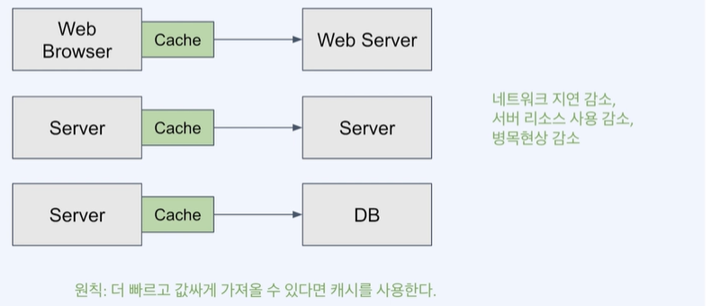
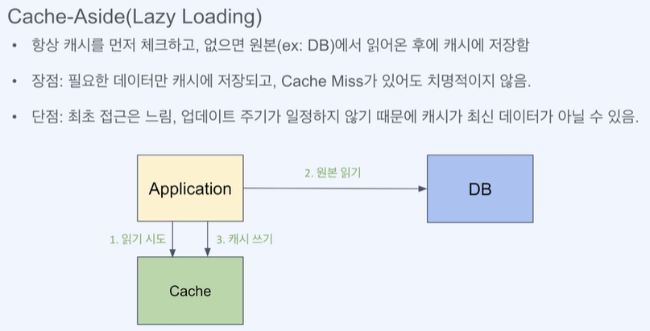
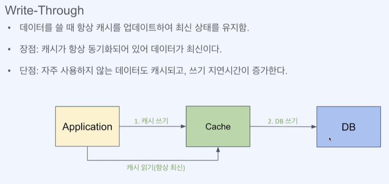
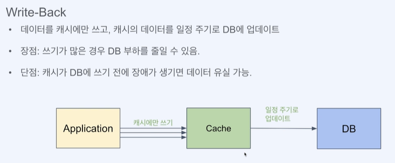
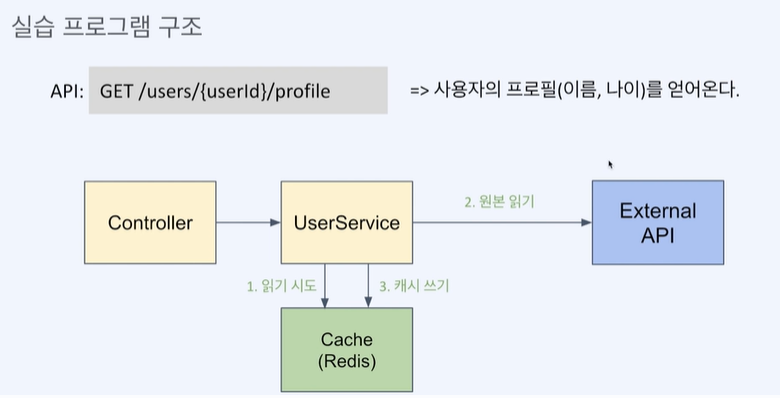

# ***Redis Cache***

- [***Redis Cache***](#redis-cache)
  - [***Caching***](#caching)
    - [***Cache 관련 개념***](#cache-관련-개념)
  - [***Redis 실습***](#redis-실습)
    - [***실습 예시***](#실습-예시)
      - [***Redis 캐시에 선 조회 후 저장하는 로직***](#redis-캐시에-선-조회-후-저장하는-로직)
    - [***Spring의 캐시***](#spring의-캐시)
      - [***Spring Cache Annotation***](#spring-cache-annotation)
      - [***SpringBoot Application 설정***](#springboot-application-설정)
      - [***SpringBoot Source 설정***](#springboot-source-설정)

---

## ***Caching***

- `cache` : 성능 향상을 위해 값을 복사해놓는 임시 저장소
- cache에 복사본을 저장해놓고 읽음으로 속도가 느린 장치를 통해 원본을 읽는 것을 방지
- cache의 데이터는 원본이 아니면 언제든 사라질수 있음



### ***Cache 관련 개념***

- `캐시 적중(Chache Hit)` : 캐시에 접근해 데이터를 발견
- `캐시 미스(Cache Miss)` : 캐시에 접근했으나, 데이터를 발견하지 못함
- `캐시 삭제 정책(Eviction Policy)` : 캐시의 데이터 공간 확보를 위해 데이터를 삭제
- `캐시 전략` : 환경에 따라 적합한 캐시 운영 방식을 선택
  - `Cache-Aside` : 캐시를 먼저 체크하여, 없으면 DB에서 데이터를 가져와 저장
    - 장점 : 필요한 데이터만 캐시에 저장, Cache Miss 가 발생해도 치명적이지 않음
    - 단점 : 항상 캐시 먼저 읽기때문에 최초 접근이 느림,  
    업데이트 주기가 일정하지 않기 때문에 캐시가 최신 데이터가 아닐수 있음
    
  - `Write-Through` : 데이터를 DB에 저장하고 캐시에도 저장
    - 장점 : 캐시가 항상 동기화되어 있어 데이터가 최신
    - 단점 : 자주 사용하지 않는 데이터도 캐싱되고, 쓰기 지연시간이 증가
    
  - `Write-Behind` : 데이터를 캐시에만 저장하고 DB에 저장하지 않음, 일정 주기로 DB 업데이트
    - 장점 : 쓰기가 많은 경우 DB 부하를 줄일 수 있음
    - 단점 : 캐시가 DB에 쓰기 전에 장애가 생기면 데이터 유실 가능성
    

- `데이터 제거 방식` : 캐시에 어떤 데이터를 언제 삭제할것인가?
  - `Expiration` : 각 데이터에 TTL(Time-To-Live)를 설정해 시간기반(Time-Based) 삭제
  - `Eviction` : 캐시가 꽉 찼을때 공간 확보를 어떻게 할지 결정하는 방식
    - `LRU(Least Recently Used)` : 가장 오랫동안 사용하지 않은 데이터를 삭제
    - `LFU(Least Frequently Used)` : 가장 적게 사용된 데이터를 삭제(최근이더라도 사용이 적으면 삭제)
    - `FILO(First In Last Out)` : 가장 먼저 들어온 데이터를 삭제

## ***Redis 실습***

### ***실습 예시***



#### ***Redis 캐시에 선 조회 후 저장하는 로직***

```java
    @Autowired
    StringRedisTemplate redisTemplate;

    public UserProfile getUserProfile(String userId) {
        String userName = null;

        ValueOperations<String, String> ops = redisTemplate.opsForValue();

        /* 캐시에서 먼저 조회 후 없으면 캐시에 저장 */
        System.out.println("캐시에서 조회");
        String cachedName = ops.get("nameKey:" + userId);
        if (cachedName != null) {
            System.out.println("캐시에서 찾음");
            userName = cachedName;
        } else {
            userName = externalApiService.getUserName(userId);
            System.out.println("캐시에 저장");
            ops.set("nameKey:" + userId, userName, 5, TimeUnit.SECONDS);
        }
        // String userName = externalApiService.getUserName(userId);

        int userAge = externalApiService.getUserAge(userId);

        return new UserProfile(userName, userAge);
    }
```

### ***Spring의 캐시***

- `CacheManager` : 캐시를 관리하는 인터페이스
- Method에 캐시를 손쉽게 적용 (Annotation 사용)

``` java
  @Cacheable("cacheName")  
  public String getCache(String key) {  
      return "cacheValue";  
  }
```

#### ***Spring Cache Annotation***

| Annotation | 설명 |
|:---:|:---|
| `@Cacheable` | 메소드에 캐시를 적용 (Cache-Asice 패턴 수행) |
| `@CachePut` | 메소드의 결과 값을 캐시에 저장 |
| `@CacheEvict` | 메소드의 키값을 기반으로 캐시에서 삭제 |

#### ***SpringBoot Application 설정***

```yaml
spring:
  cache:
    type: redis
```

#### ***SpringBoot Source 설정***

``` java
# Main Class에 Annotation 설정
@EnableCaching
@SpringBootApplication
public class SpringCacheApplication {
    public static void main(String[] args) {
        SpringApplication.run(SpringCacheApplication.class, args);
    }
}
```
