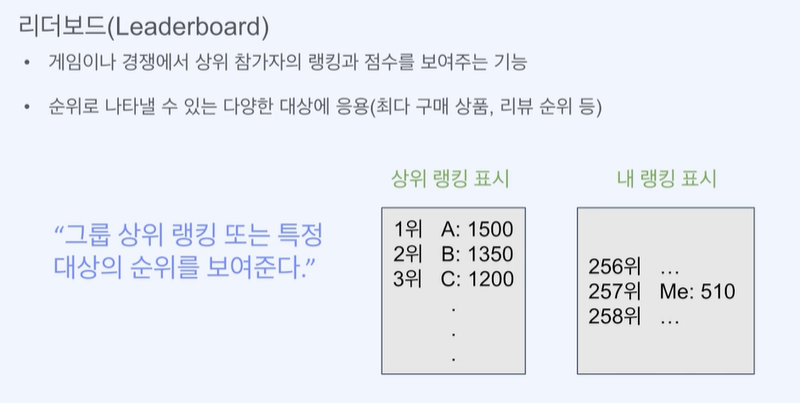

# **리더보드 만들기**

## ***리더보드란?***

- 리더보드는 게임에서 플레이어들의 순위를 보여주는 기능입니다.
- 누위로 나타낼 수 있는 다양한 대상에 응용 가능(최다 구매 상품, 리뷰 순위)



## ***리더보드의 동작 (API 관점)***

- 점수 생성/업데이트 => SetScore(userId, score)
- 상위 랭크 조회(범위 기반 조회) => getRank(1~10)
- 특정 대상 순위 조회 (값 기반 조회) => getRank(userId)

### ***데이터 구조와 성능 문제***

- 관계형 DB 등의 레코드 구조를 사용했을떄
  - 업데이트 : 한 행에만 접근하므로 비교적 빠름.
  - 범위나 대상 조회 : 데이터를 정렬하거나 COUNT()등의 집계 연산을 사용하여 데이터가 많을 수록 느려짐.

- Redis를 사용했을때
  - 업데이트 : 키를 기준으로 접근하므로 빠름.
  - 범위나 대상 조회 : 정렬된 집합(`Sorted-Set`)을 사용하므로 빠름.

### ***Redis를 사용했을때 장점***

- 순위 데이터에 적합한 `Sorted-Set`의 자료구조를 사용하면 **Score를 통해 자동정렬**
- 용도에 특화된 **오퍼레이션 (Set 삽입/업데이트/조회)가 존재**하여 편리
- 자료구조의 특성으로 **데이터 조회가 빠름(범위검색, 특정값의 순위 검색)**
- 빈번한 액세스에 유리한 **In-memory DB의 속도**

### ***SpringBoot 구현***

```java
    @Autowired
    StringRedisTemplate redisTemplate;


// ZSetOperations = Sotred-Set을 다루는 인터페이스
    public boolean setUserScore(String userId, int score) {
        // SortedSet의 경우 ZSet을 사용
        ZSetOperations<String, String> zSetops = redisTemplate.opsForZSet();
        zSetops.add(LEADERBOARD_KEY, userId, score);
        return true;
    }

    public Long getUserRank(String userId) {
        ZSetOperations<String, String> zSetops = redisTemplate.opsForZSet();
        return zSetops.reverseRank(LEADERBOARD_KEY, userId);
    }


    public List<String> getTopRank(int limit) {
    ZSetOperations<String, String> zSetops = redisTemplate.opsForZSet();
    Set<String> rangeSet = zSetops.reverseRange(LEADERBOARD_KEY, 0, limit - 1);
        return new ArrayList<>(rangeSet);
    }
```
