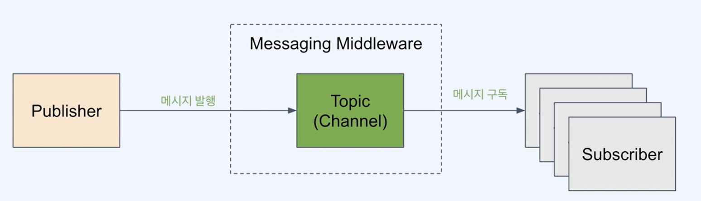
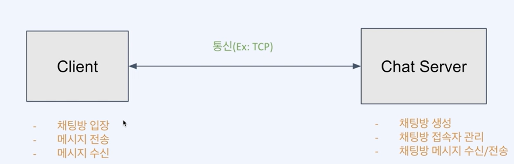
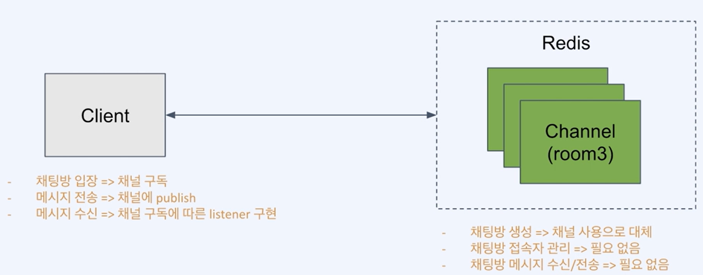

# ***Redis Pub/Sub***

- [***Redis Pub/Sub***](#redis-pubsub)
  - [***Pub/Sub이란?***](#pubsub이란)
  - [***메시징 미들웨어 사용의 장점***](#메시징-미들웨어-사용의-장점)
  - [***Redis의 Pub/Sub***](#redis의-pubsub)
    - [***Redis의 Pub/Sub 유즈케이스***](#redis의-pubsub-유즈케이스)
    - [***Redis Pub/Sub 구현***](#redis-pubsub-구현)
      - [***채팅방 구현***](#채팅방-구현)

---

## ***Pub/Sub이란?***
  
- 메시징 모델 중 하나로 발행(`Publisher`)과 구독(`Subscriber`)이라는 개념을 사용
- 발행자와 구독자는 서로에 대한 정보가 없이, **특정 주제를 매개로 메시지를 주고받음**



## ***메시징 미들웨어 사용의 장점***

- 비동기 : 통신의 비동기 처리
- 낮은 결합도 : 송신자와 수산자 간 서로에 의존하지 않고 미들웨어에 의좀
- 탄력성 : 구성원들간 느슨한 연결로 일부 장애가 생경도 영향이 최소화됨

> 미들웨어 제품들 : Kafka / RabbitMQ / ActiveMQ / Redis Pub/Sub 등

## ***Redis의 Pub/Sub***

- 메시지가 큐에 저장되지 않음
- Kafka의 컨슈머 그룹과 같은 분산처리 개념이 없음
- 메시지 발행 시, Push 방식으로 subscriber에 전달
- subscriber가 늘어날수록 성능이 저하

### ***Redis의 Pub/Sub 유즈케이스***

- **실시간으로 빠르게 전송**되어야 하는 메시지
- **메시지 유실을 감내**할 수 있는 케이스
- **최대 1회 전송**(at-most_once) 패턴이 적합한 케이스
- Subscriber들이 다양한 **채널을 유동적으로 바꾸면서 한시적으로 구독**하는 경우

### ***Redis Pub/Sub 구현***

#### ***채팅방 구현***

- 요구사항
  - 클라이언트와 서버가 존재하고 통신하는 방식을 정해야함
  - 채팅 서버는 채팅방 관리 로직을 작성해야함
  - 

- Redis Pub/Sub을 이용한 구현
  - 채팅방 기능을 Pub/Sub 구조로 이용해 쉽게 구현
  - 

- ***구현***

```java
// Configuration
    @Bean
    public RedisConnectionFactory redisConnectionFactory() {
      return new LettuceConnectionFactory(); 
    }

    @Bean
    RedisMessageListenerContainer redisContainer() {
        final RedisMessageListenerContainer container = new RedisMessageListenerContainer();
        container.setConnectionFactory(redisConnectionFactory());
        return container;
    }

```

```java
// Service
// Class implements
@Service
public class ChatService implements MessageListener {

  @Autowired RedisMessageListenerContainer container;
  @Autowired RedisTemplate<String, String> redisTemplate;

  public void enterChatRoom(String chatRoomName) {
        // Message Listener 등록 (토픽 구독)
        container.addMessageListener(this, new ChannelTopic(chatRoomName));
        Scanner in = new Scanner(System.in);
        while (in.hasNextLine()) {
            String line = in.nextLine();
            if (line.equalsIgnoreCase("q")) {
                System.out.println("Exit!");
                break;
            }
            redisTemplate.convertAndSend(chatRoomName, line);
        }
        in.close();
    }

  // Listner의 onMessage (수신 핸들러) 구현
   @Override
    public void onMessage(Message message, byte[] pattern) {
        System.out.println("Message received: " + message.toString());
    }

}
```