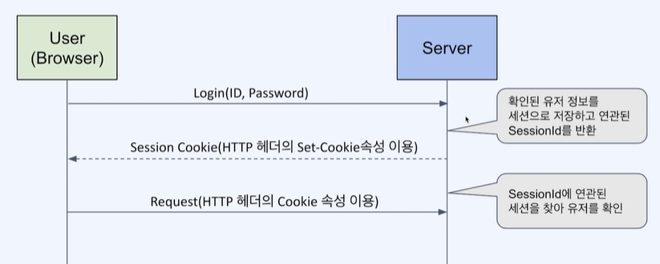
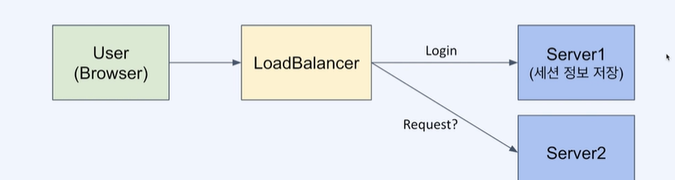
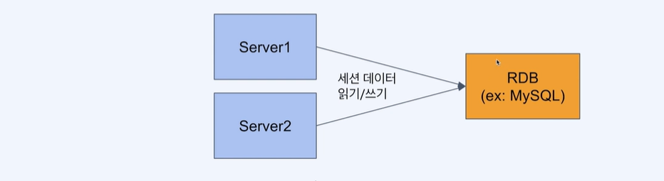
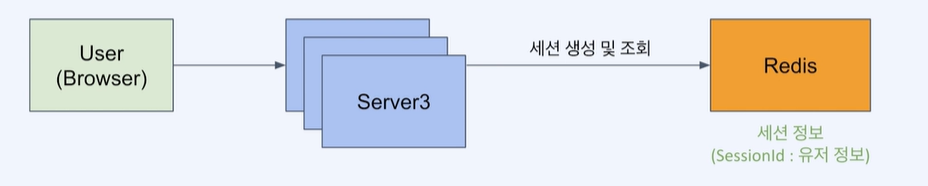
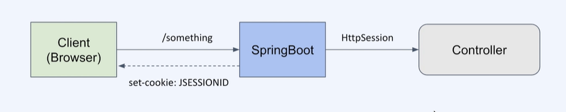

# ***Redis Session***

- [***Redis Session***](#redis-session)
  - [**Session**](#session)
  - [**Web Login Session**](#web-login-session)
  - [**분산 환경에서의 Session**](#분산-환경에서의-session)
    - [**분산환경에서의 Session 처리 - RDB**](#분산환경에서의-session-처리---rdb)
    - [**분산환경에서의 Session 처리 - Redis**](#분산환경에서의-session-처리---redis)
  - [**Session 관리 서버의 역할**](#session-관리-서버의-역할)
    - [**SpringBoot에서 세션 관리**](#springboot에서-세션-관리)
      - [***특징***](#특징)
      - [***사용법***](#사용법)
      - [***SpringBoot에서 Session을 사용하는 방법***](#springboot에서-session을-사용하는-방법)

## **Session**

- 네트워크 상에서 두 개 이상의 통신 장치간에서 유지되는 상호 연결
- 연결된 일정 시간 동안 유지되는 정보를 나타냄
- 적용 대상에  따라 다른의미를 가짐

## **Web Login Session**

- Web상에서 특정 유자가 로그인했음을 나타냄
- 브라우저는 쿠키를, 서버는 해당 쿠키에 연관된 세션 정보를 저장
- 유저가 로그아웃하거나 세션이 만료될떄 까지 유지되어 유저에 특정한 서비스 가능



## **분산 환경에서의 Session**

- Server는 세션 정보를 저장해야함
- Server가 여러대라면 최초로그인한 Server 가아닐경우 세션 정보를 찾을수 없음
- Session 정보를 공유하는 방법이 필요(Session Clustering)



### **분산환경에서의 Session 처리 - RDB**

- 관계형 데이터 모델이 필요한가?
  - 아니오. 세션 정보는 단순한 Key-Value 형태로 저장하면 됨
- 영속성이 필요한 데이터인가?
  - 아니오. 세션 정보는 일정 시간이 지나면 만료되어야 함
- 성능 요구사항을 충족하는가?
  - 아니요. 세션 정보는 빠르게 조회되어야 함



### **분산환경에서의 Session 처리 - Redis**

- 세션 데이터는 Key-Value 형태로 저장
- 세션 데이터는 영속성이 필요하지 않음
- 세션 데이터는 변경이 빈번하고 빠른 액세스 속도가 필요



## **Session 관리 서버의 역할**

- `세션 생성` : 요청이 들어왔을 때 세션이 없다면 생성하여 set-cookie로 전달
- `세션 조회` : 요청이 들어왔을 때 세션이 있다면 조회하여 사용
- `세션 삭제` : 타임아웃이나 명시적 로그아웃이 발생하면 세션을 무효화

### **SpringBoot에서 세션 관리**

- SpringBoot에서는 세션 관리를 위해 `HttpSession`을 사용

`HttpSession` : Session을 손쉽게 생성하고 관리할 수 있는 인터페이스

#### ***특징***

- UUID로 Session Id를 생성
- JSESSIONID라는 이름의 cookie를 설정하여 전달

#### ***사용법***

- `setAttribute(name, value)`로 Session에 데이터를 저장
- `getAttribute(name)`로 Session에서 데이터를 조회
- `removeAttribute(name)`로 Session에서 데이터를 삭제



#### ***SpringBoot에서 Session을 사용하는 방법***

SpringBoot Application.yml에 다음과 같이 설정

```yml
spring:
    # 중요!! 
    session:
        store-type: redis
    redis:
        host: localhost
        port: 6379
```

Java 코드에서 다음과 같이 사용

```java
    @GetMapping("/login")
    public String login(HttpSession httpSession, @RequestParam String name) {
        // 설정된 Redis에 Session을 저장
        httpSession.setAttribute("name", name);
        return "saved";
    }
```
